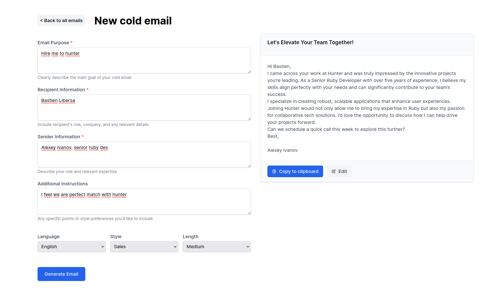

# README

For local test I will provide master key in email.

place provided master.key in `config/master.key` folder.

`bin/setup` should be enough to setup the project.
`bin/dev` to start the app. Please have default redis running on localhost:6379 for sidekiq and actioncable.

visit http://localhost:3000 and enjoy!

## Some notes:
- tried to do separate commits in case one might follow process
- used scaffold for fast prototyping
- nice that Rails 8 has Github actions integration out of box!
- haven't got Solid queue working out of box seems like some bug in Rails https://github.com/rails/solid_queue/issues/377. used sidekiq instead to save time

## Steps of project:

- [x] Create basic app
- [x] Create ColdEmail and gpt generator
- [x] Refactor controller to use form
- [x] Add response on same page with turbo
- [x] Add loader for generating
- [x] Use background job for email generation

## Todos:
- [] store generation params for future purposes (maybe we want to regenerate for example)
- [] Add sidebar with links to other email for nicer navigation
- [] Use response streaming for email generation
- [] Check and add some error handling for streaming job result
- [] Add some beautiful styles!
- [] Falcon will be a good choice for such app
- [] Add tests

